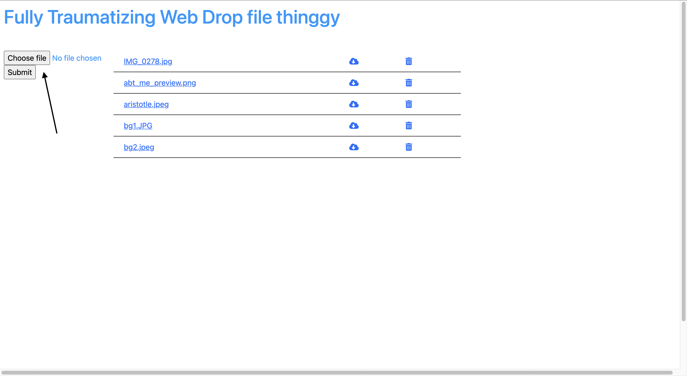
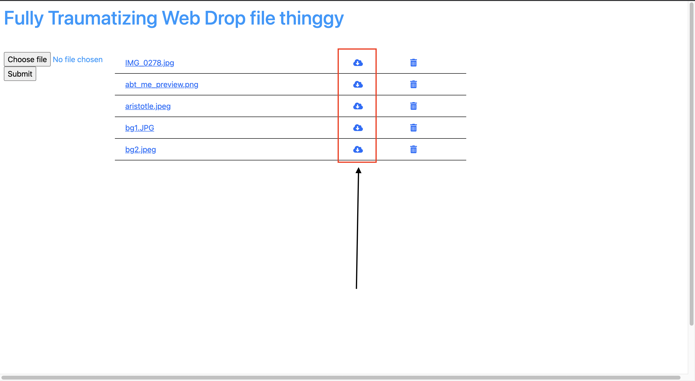
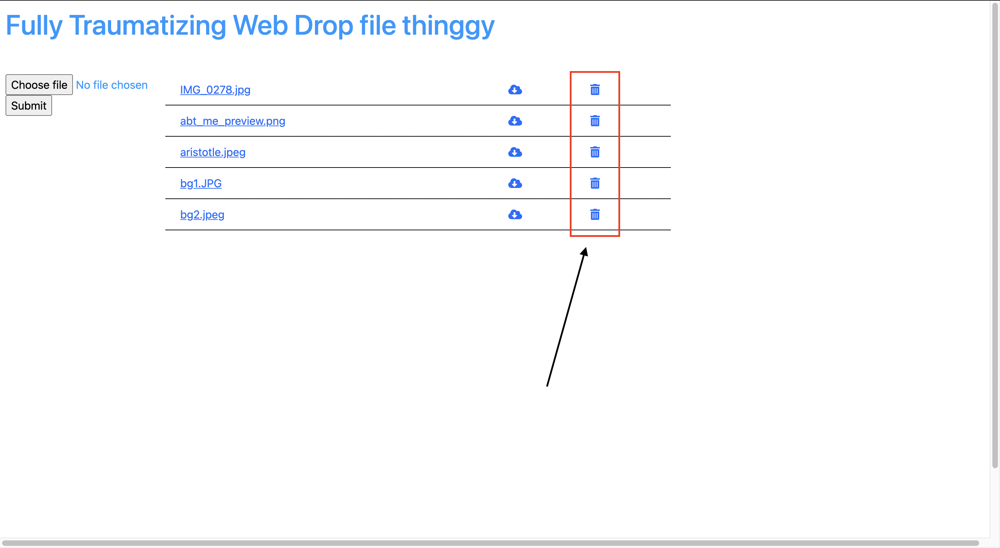
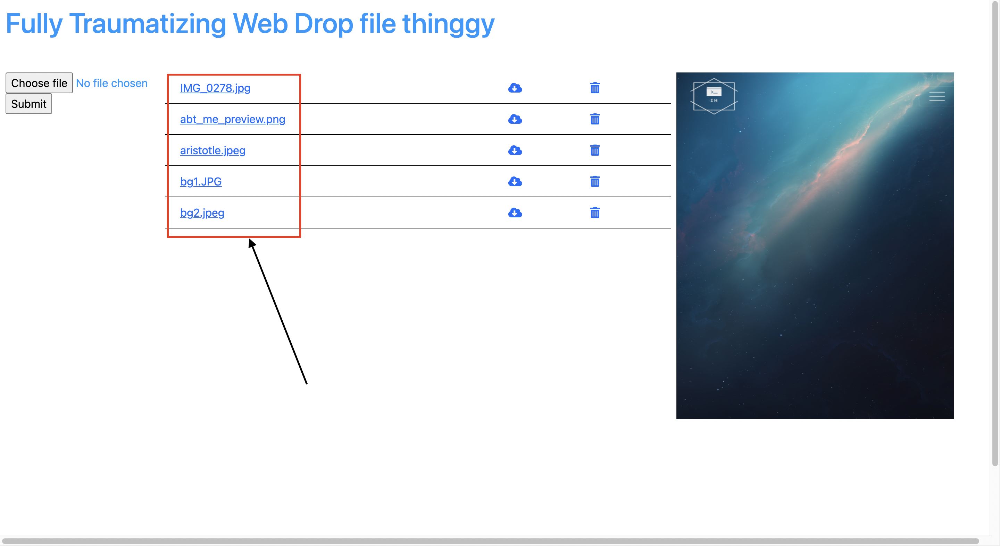

# This is the Fully Traumatizing Web Drop file thinggy  
  
## aka FTWD  
Please npm install in your terminal before you start the server  
nodemon main.js in your terminal to start the server  
  
### Get started  
  
click on choose file to select the file you want to upload  
then click the submit  

  
click on the cloud next to any file to download them  

  
click on the trash can next to any file to remove them  

  
click on any image name to preview them